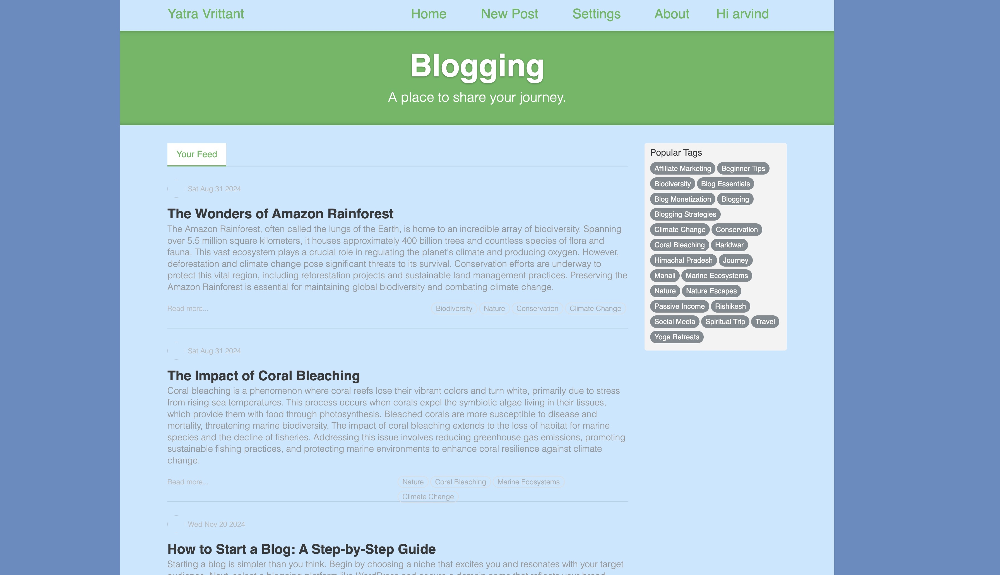

# Journey Compass - MERN Blogging Website 📝

A full-stack blogging platform built using the MERN stack (MongoDB, Express.js, React, Node.js). Users can sign up and log in using JWT-based authentication, create articles, and comment on posts.

## 📸 Screenshots

### 🔐 Hero Page

## ✨ Features

- 🔐 User Authentication (JWT-based)
- 📝 Create, Read, Update, and Delete (CRUD) Articles
- 💬 Comment on Articles
- 👤 Protected Routes for Logged-in Users
- 🧾 MongoDB for database storage
- 🌐 RESTful API with Express.js
- ⚛️ React frontend with clean UI

---

## 🚀 Technologies Used

**Frontend:**
- React
- Axios
- React Router DOM

**Backend:**
- Node.js
- Express.js
- MongoDB with Mongoose
- JSON Web Token (JWT)
- Bcrypt.js (for password hashing)

**Documentation** - https://obvious-cosmos-bed.notion.site/API-Documentation-a346a55b65af41d69d3ab229dbcd0173

**Site Live At** - [https://blogging-website-react.netlify.app/](https://journey-compass.netlify.app/)

## PostMan File - 
userRoutes.postman_collection.json file contains postman setup for verifying routes

